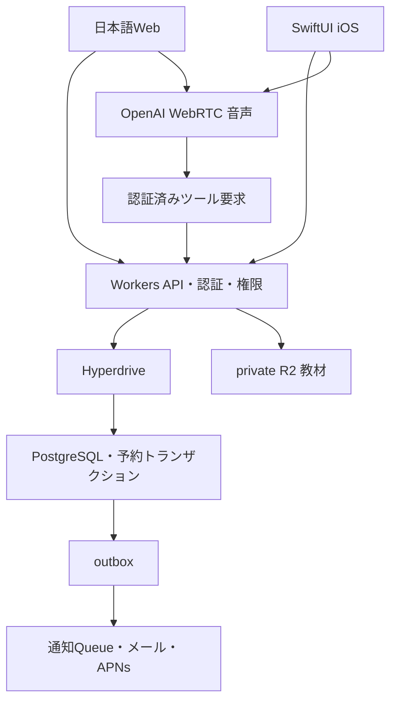

# アーキテクチャ

## 選択
Web: React + TypeScript + Vite + Tailwind + Radix系アクセシブル部品 + TanStack Query/Table。API: Cloudflare Workers + Hono + Zod。DB: Supabase管理PostgreSQL。WorkersからHyperdriveで接続し、予約関連読み取りはキャッシュ無効。Auth: Supabase Auth（招待・メール/パスワード、管理者MFA）。教材: private Cloudflare R2。通知: transactional outbox→Cloudflare Queue→メール配送/APNs。iOS: SwiftUI、URLSession、Supabase Swift Auth、Keychain、AVAudioSession、検証したWebRTC配布物。OpenAI Realtimeは短期クライアント資格情報で直接WebRTC接続。

## 認証・DB境界
WebはBFFログインでHttpOnly Secure SameSite cookieにサーバー側セッションIDを保存。アクセストークン/refresh tokenはサーバーで保管、ブラウザlocalStorageへ秘密を置かない。CSRFトークンとOrigin検証をすべてのcookie認証変更操作に使用する。iOSはAuthプロバイダのトークンをKeychain保存、URLSessionがBearerを送る。Web session cookieとBearerの曖昧な混在を拒否する。
WorkersはJWT署名/JWKS・issuer・audience・expを検証し、DBの有効membershipを毎要求確認。org_id・actor_user_idは認証から導出、リクエスト値を信用しない。公開登録は初期無効、管理者招待のみ。Supabase Admin API秘密はWorkersだけに配置。
PostgreSQLのappスキーマをAPIの公開Data API対象から外す。API専用DB roleはNOSUPERUSER NOBYPASSRLSで運用、DDL権限なし。トランザクション冒頭で `set_config('app.org_id', ..., true)` を設定し、組織RLSが適用される。教師/本人単位の権限はAPI repositoryでさらに絞る。SQL関数も権限を検査する。RLSは組織分離の防御であり、教師/本人の全権限制御を代替しない。
接続プールを跨ぐcontext混入を防ぐためSET LOCALを使い、BEGIN→context→処理→COMMIT/ROLLBACKを同一接続で行う。DB owner/service_roleを通常API実行に使わない。

## 予約・同期
同じ授業slotの行ロックで予約申請/承認/取消/期限切れを直列化。pendingも期限まで席を保持。expires_at到達でexpiredへ移行し解放。DB変更+監査+outboxを同一transactionで記録。Web前景で5秒ポーリング、iOSの前景復帰/操作後に即再取得。APNsは更新の通知、正確な状態は必ずAPIで取得する。

## ファイル
教材は20MB/PDF、200MB/動画、10MB/画像を初期上限。Content-Typeだけでなくmagic bytes、拡張子、ファイル長を検証。検疫prefixへアップロードしマルウェアスキャン、結果がcleanのときのみpublished。実スキャナを接続できない場合は教材公開を停止してブロッカーとして扱う。ファイル名をobject keyに使わずUUID、path traversal拒否。ダウンロードは権限確認後に5分署名URL。授業URLは承認済み本人または担当講師/管理者のみ。

## 外部障害
DB障害は変更を成功表示しない。通知失敗はDB結果を取消せずoutbox再試行。429指数バックオフ+jitter、再試行は冪等キー固定。AI失敗は日本語テキスト操作へ案内。監査に認証情報・音声全量・教材全文を記録しない。

## 公式資料（確認日2026-10-02）
- https://developers.cloudflare.com/hyperdrive/ — WorkersからPostgreSQLへ接続。
- https://supabase.com/docs/guides/auth/signing-keys — 非対称JWT検証。
- https://supabase.com/docs/reference/swift/auth-signinwithpassword — Swiftのメール/パスワード認証。
- https://developers.openai.com/api/docs/guides/voice-webrtc — WebRTCと短期秘密。
実装開始時に利用バージョンを公式資料で再確認し、lockfileとPackage.resolvedを保存する。
